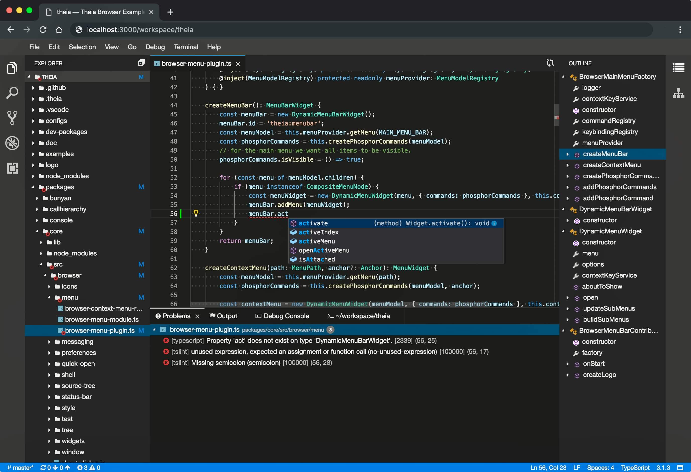
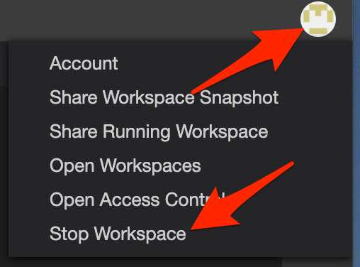
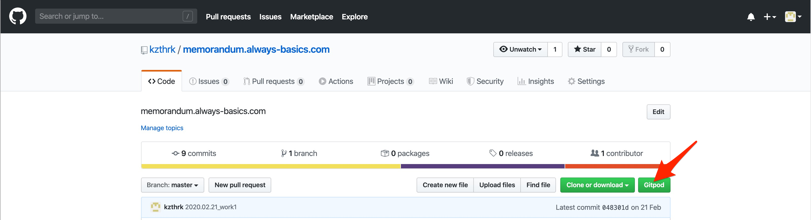
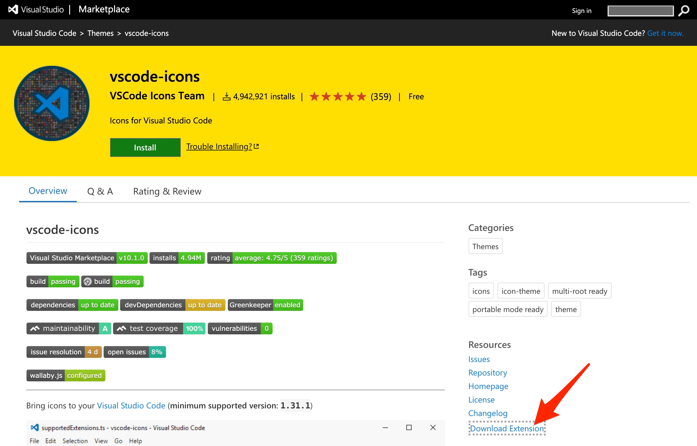
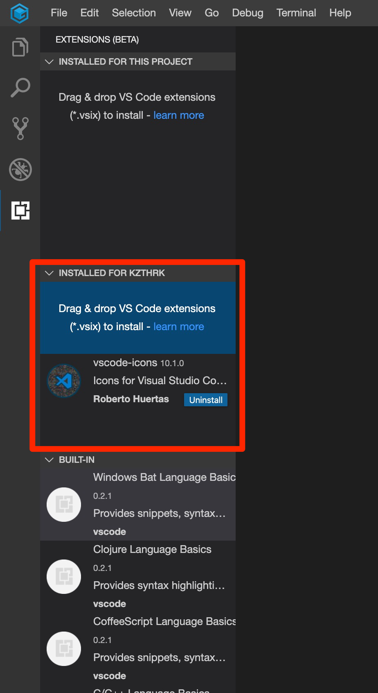

# はじめに
## Theiaとは
まずは読み方ですが、**[テイア](https://ja.wikipedia.org/wiki/%E3%83%86%E3%82%A4%E3%82%A2_(%E4%BB%AE%E8%AA%AC%E4%B8%8A%E3%81%AE%E5%A4%A9%E4%BD%93))**と読むようです。
Theiaとは[公式ページ](https://theia-ide.org/)の説明を借りれば

> Eclipse Theia is an extensible platform to develop multi-language Cloud & Desktop IDEs with state-of-the-art web technologies.

Eclipse Theiaは、最先端のWebテクノロジーを使用して多言語のクラウドおよびデスクトップIDEを開発するための拡張可能なプラットフォームです。

### だからなに？

我々一般ユーザーにとって見れば、このスクリーンショットのような開発環境が提供されるってことです。

### つまりは？

こちらの記事で紹介されていますが、デスクトップ版とブラウザ版が想定されていて、どちらでも同じソースコードで開発環境が提供されることになります。

[Visual Studio Codeの代替を狙う統合開発環境「Eclipse Theia 1.0」リリース。VS Codeの拡張機能を利用可能、デスクトップ版とWebブラウザ版に両対応](
https://www.publickey1.jp/blog/20/visual_studio_codeeclipse_theia_10vs_codeweb.html
)

> Eclipse Theiaは、「真のオープンソースによるVisual Studio Codeの代替」（a true open source alternative to Microsoft’s popular Visual Studio Code (VS Code) software）だとEclipse Foundationは紹介しており、デスクトップアプリケーションだけでなくWebブラウザからも同一機能が利用できるWebアプリケーション版も提供されています。

### Theiaとは？

仕切り直しますね。**Theia** とはVS Code(Vidual Studio Code)そっくりなんですが、それがブラウザの中で(も)動きます。先に書いた通りデスクトップ版もありますが、デスクトップ版というのはElectronでパッケージングしたものになるので、それってそのまんまVS Codeじゃんってことですね。

*脱線: ElectronとはNode.jsのアプリ(サーバーサイド)とChromium(ブラウザ)を一塊にすることでデスクトップ・アプリケーションにするフレームワークです。*

この投稿を読んでいる方がVS Codeを聞いたことがないとは思えないですが、念のため簡単に触れておくと、Microsoftが開発しているElectronベースのソースコードエディタです。
ソースコードエディタって微妙な表現ですが、MicrosoftはVisual Studioという統合開発環境をもっていてそのエディタ部分だけを切り出したというイメージなので、VS Code自身はソースコードエディタという説明に。
ただご承知の通り、だれもソースコードエディタとしての使用にとどまっている人はおらず、豊富な拡張機能を **拡張機能(プラグイン)** をガシガシインストールして統合開発環境として使用している訳です。

一方で、TheiaはEclipseが開発しているので別物ではあります。ですが、TheiaはVS Codeそっくりなだけでなく **VS Codeの拡張機能(プラグイン)** が使えます。いよいよヤバイ感じですね。
はっきり言って、第一印象は丸パクリ状態です。

## Theiaを使ってみる

### Gitpodを使ってみる

まず真っ先に試してみるべきは、ブラウザで動作するこちらです。
[公式ページ](https://theia-ide.org/)の**Try in Gitpod**を利用します。

Gitpodへ移動すると、 **Login with Github & Launch Workspace** をクリックします。

Githubのアカウントで認証します。

拡張機能のインストールの案内が出てくるはずです。 **Get Chrome Extension** をクリックします。

すでにインストールしてしまった状態で画面をキャプチャしたので、ボタンが削除になっているのは許してください。

そして、いよいよ...いよいよ...　ええ、Dockerですのでしばらくお待ちください。
こんな状態になっていると思います。

これが、GitpodによるTheiaです。
Theia自身の開発をしたい人はこのままで良いかと思いますが、多分そんな人はほとんどいないと思いますので一旦閉じます。

右上のアイコンをクリックするとメニューが表示されるので、 **Stop Workspace** をクリックします。

**Workspaces** をクリックします。

ワークスペースのリストが表示されていることと思います。

この画面は何度か訪れることになりますが、今は自分の環境を手に入れることが目的なので、一旦放置します。
Githubの自分のリポジトリにブラウザでアクセスします。

**Gitpod** ボタンがあるはずなのでクリックしてください。

これで、 **拡張機能** なし状態のVS Codeでプロジェクトを開いた環境が手に入りました。

### 拡張機能をインストールしてみる

さて、先ほどから何度となくVS Codeの拡張が使えると言ってきました。
ですが、拡張機能をインストール使用としてみても、検索なんて出来ません。

これは、VS Codeの拡張機能には少し制限があるためです。

Microsoftは、Visual Studio Marketplaceを他のソフトウェアに直接使用することを禁止しているのです。
拡張機能事態はそのほとんどがオープンソースで、Microsoftによって開発または保守されていませんが、[マーケットプレイス](https://marketplace.visualstudio.com/vscode)へのアクセスが制限されています。

ということで、[マーケットプレイス](https://marketplace.visualstudio.com/vscode)にアクセスして、直接ファイルを手に入れてTheiaにインストールするという流れを取ります。
また多くの拡張がGithubを利用しているのでこちらで手に入れても構いません。

早速ですが[Japanese Language Pack](https://marketplace.visualstudio.com/items?itemName=MS-CEINTL.vscode-language-pack-ja)を例にインストールしてみたいと思います。

vsixファイルをダウンロードするためのリンクが用意されていますので、それをクリックします。

手元にダウンロードしたファイルを、TheiaにDrag & Dropするとインストールできます。
(っていうか、リンク教えたらそっちで勝手にやってよって感じですが・・・)

右下にダイアログが表示されるので、有効化をクリックします。

この例だとインストール前とそれほど変わってませんが、一応有効になったようです。

## Theiaを使ってみる　その2

Electron版つまりは、デスクトップ版はについては、また改めて記載したいと思います。
